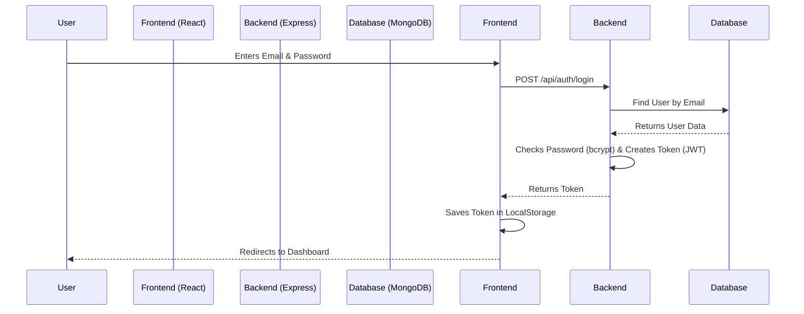
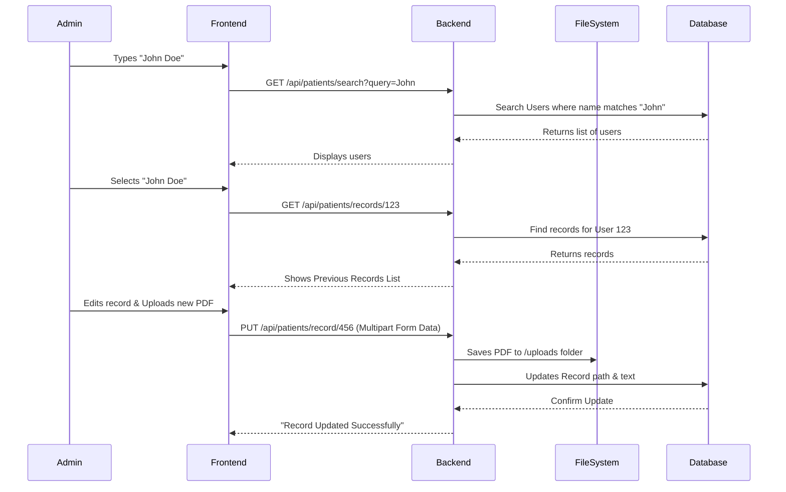

# App Architecture & Data Flow Explained

This document explains **Quantum Dentistry** in simple terms, breaking down how the Backend and Frontend talk to each other and how data moves.

## 1. The Technology Stack (The Parts)

*   **Frontend (The Face):** React + Vite. This is what you see in the browser.
*   **Backend (The Brain):** Node.js + Express. This runs on the server/cloud.
*   **Database (The Memory):** MongoDB. This stores all users and records.
*   **Connector:** Axios (Frontend) & API Routes (Backend).

---

## 2. Backend Explained (Line by Line logic)

Think of the Backend as a **Restaurant Kitchen**.

1.  **`server.js` (The Manager):**
    *   It starts the server (opens the restaurant).
    *   It connects to MongoDB (opens the pantry).
    *   It tells the app where to send orders (Routes).

2.  **Routes (`/routes/*.js`) (The Waiters):**
    *   They take specific requests from the frontend.
    *   Example: A request to `/api/patients/record` goes to the `patients.js` route.
    *   They check your ID card (JWT Token) to make sure you are an Admin.

3.  **Controllers (`/controllers/*.js`) (The Chefs):**
    *   They do the actual work.
    *   **Logic:** "Find User with ID 123" or "Save this file to the folder".
    *   They talk to the Database directly.

4.  **Database Models (`/models/*.js`) (The Recipes):**
    *   They define what data looks like.
    *   Example: A `User` must have a name, email, and password.

---

## 3. Frontend Connection (How it talks)

The Frontend is the **Customer**.

1.  **User Action:** You click "Save Record".
2.  **`AuthContext.jsx` & Axios:** This is the messenger.
    *   It knows the backend address (Base URL).
    *   It attaches your "ID Card" (Token) to every message automatically.
3.  **Sending:** It sends a data packet (JSON or Form Data) to the backend.
4.  **Receiving:** It waits for the backend to say "Success!" (Status 200) and then updates the screen.

---

## 4. Visual Flow Charts

### A. Login Flow (Getting Access)
Processing credentials and receiving the secure key (Token).

### B. Patient Search & Record Update (Admin Flow)
How the admin finds a patient and updates their medical data.

---

## 5. Directory Structure Mapping

*   `src/` -> **Frontend Code**
    *   `src/components/AdminPatientSection.jsx` -> The UI you just edited.
    *   `src/context/AuthContext.jsx` -> Handles the Login/Token logic.
*   `server/` -> **Backend Code**
    *   `server/routes/` -> API Endpoints (The URLs).
    *   `server/controllers/` -> The logic functions.
    *   `server/models/` -> The Database Schemas.
